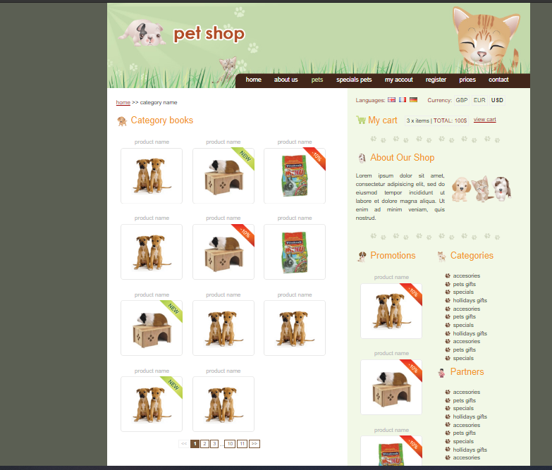

# A Blog For Adding Articles

---

## Description

- A Java Web Application (3.0) For Adding Pets

#### Fonctionnalites

- Crud Pets
- Pets Pagination
- Multi Lang (fr/eng/ger)
- File Upload (img jpg using blob)
- Send Email requires config [conf](#conf)
- Login
- Encrypt Pass

---

#### Technologies

- Java (jsp/servlet/jdbc)
- MYSQl
- Html / Css

---

#### conf

- You Can Configure The Data Base In package com.db;
- Mail Config

1. Create a Gmail Acount And Activate Activate less Secure App To Send Email Using SMTP
2. Change In The Packg com.controller in the method SendMailhtml String username = "xxxxx@gmail.com";
   String password = "xxxxxx";

#### Installation

1. Execute petshopdb.sql scripte To Create the Data Base
2. Import The Project Or Deploy The war

---

#### Tools

- Eclipse
- Xammp
